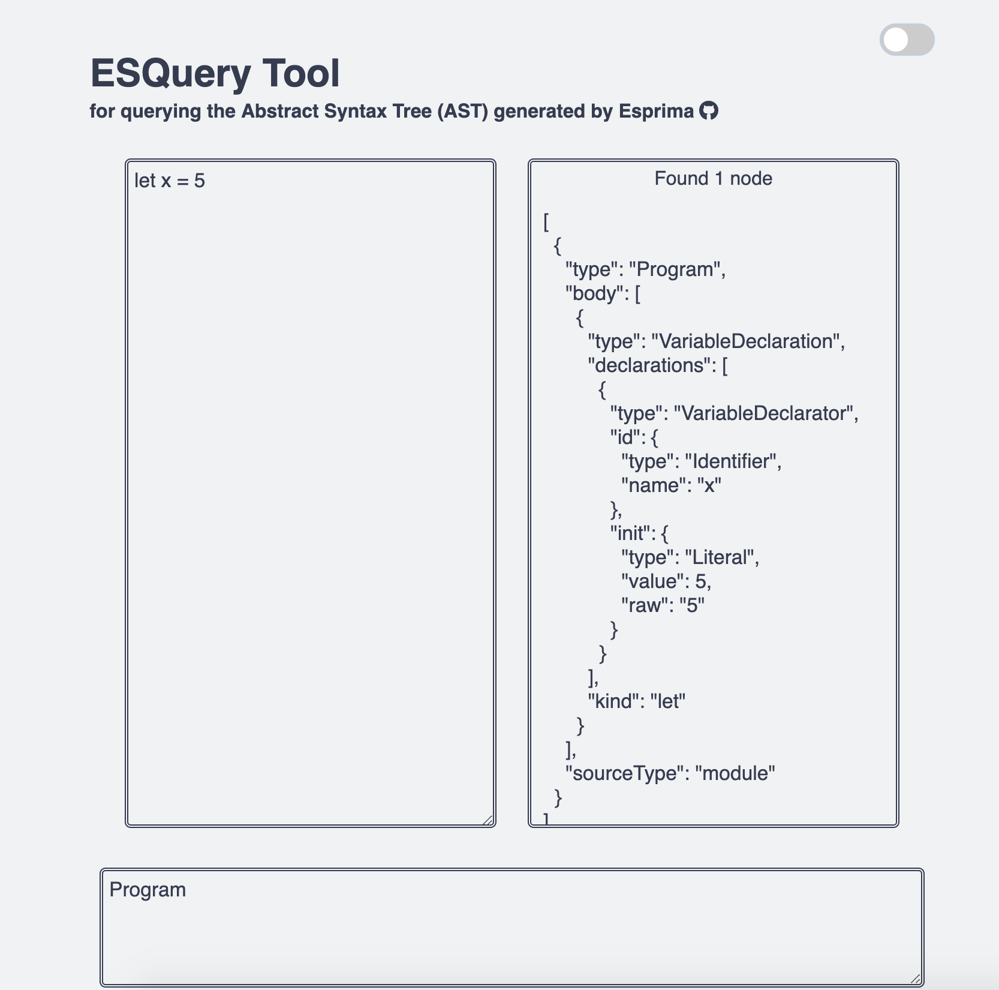
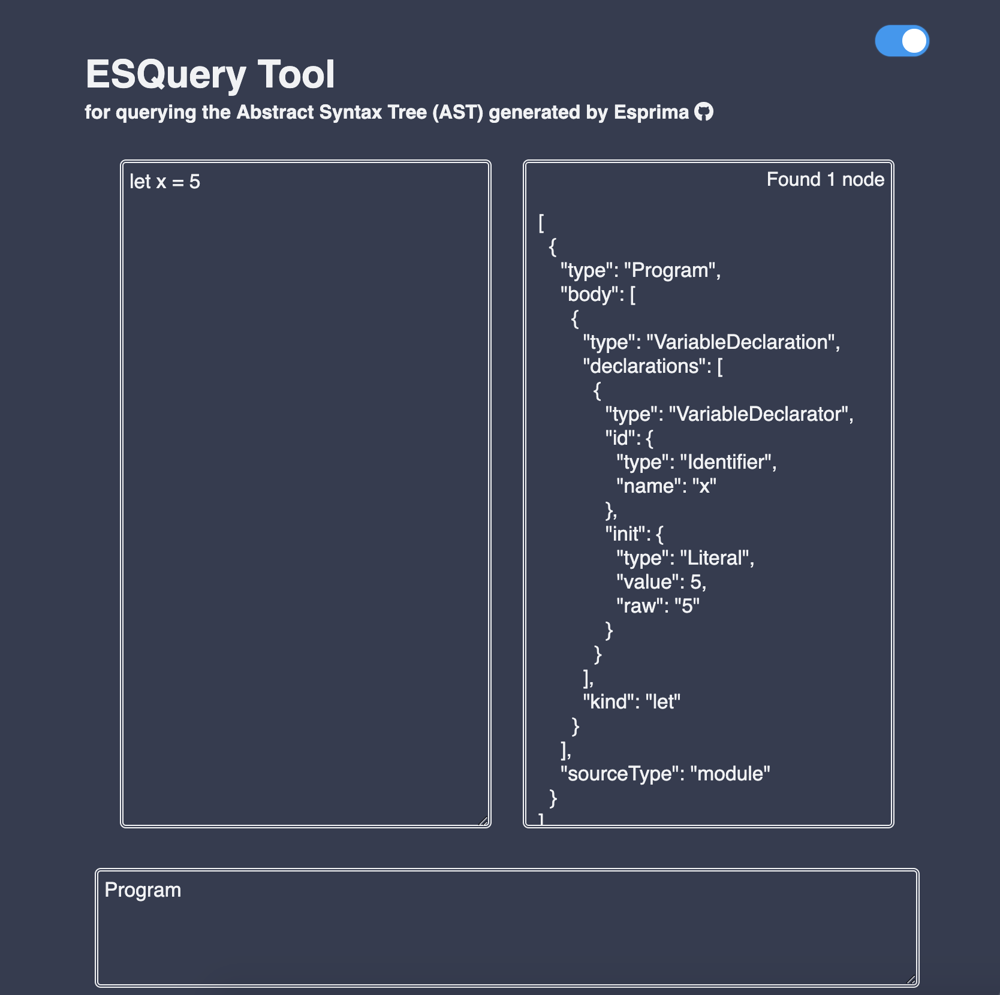

# ESQuery Tool

## About
This  is a tool for querying the Abstract Syntax Tree (AST) that's generated by the Esprima parser.

To learn more about ESQuery, <a href="https://github.com/estools/esquery">click here</a>.

To learn more about Esprima, <a href="https://github.com/jquery/esprima">click here</a>.

## Features
* Simplied, clean UI
* Responsive Design
* Error handling 
* Light & Dark mode 

## Screenshots

## References
* <a href="https://estools.github.io/esquery/">original</a> by <a href="https://github.com/estools">estools</a>
* <a href="https://github.com/mcleary03/esqueryREPL">esqueryREPL</a> by <a href="https://github.com/mcleary03">mcleary03</a>
* <a href="https://github.com/bcorman/esquery-training">ast-training-repl</a> by <a href="https://github.com/bcorman">bcorman</a>
