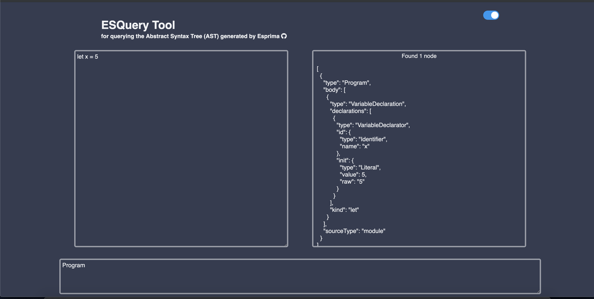
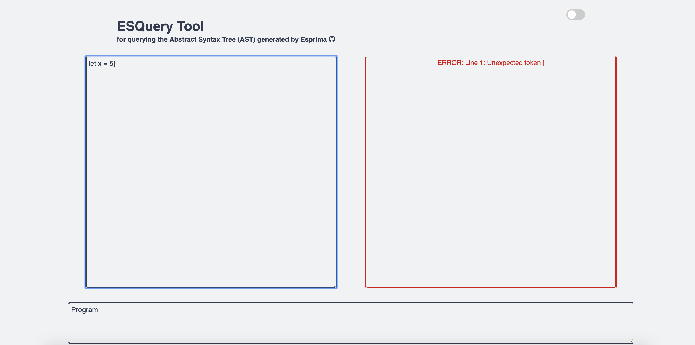
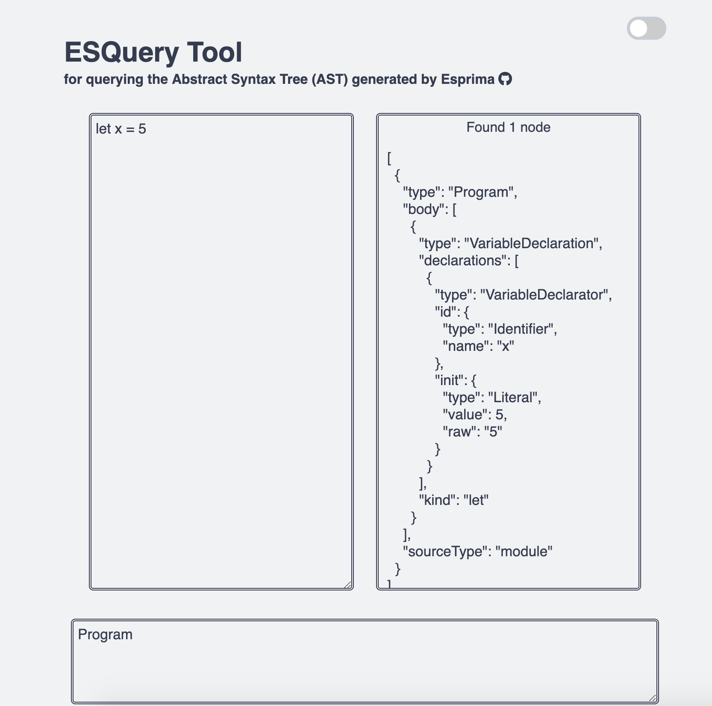

# ESQuery Tool

## About
This is a tool that uses the ESQuery library to query the Abstract Syntax Tree (AST) that's generated by the Esprima parser. Visit the <a href="https://natalie-poulson.github.io/ESQuery-tool/" target="_blank">website</a>.

To learn more about ESQuery, <a href="https://github.com/estools/esquery" target="_blank">click here</a>.

To learn more about Esprima, <a href="https://github.com/jquery/esprima" target="_blank">click here</a>.

## Features
* Simplied, clean UI
* Responsive Design
* Error handling 
* Light & Dark mode 

## Screenshots

## References
* <a href="https://estools.github.io/esquery/" target="_blank">original</a> by <a href="https://github.com/estools" target="_blank">estools</a>
* <a href="https://github.com/mcleary03/esqueryREPL" target="_blank">esqueryREPL</a> by <a href="https://github.com/mcleary03" target="_blank">mcleary03</a>
* <a href="https://github.com/bcorman/esquery-training" target="_blank">ast-training-repl</a> by <a href="https://github.com/bcorman" target="_blank">bcorman</a>

